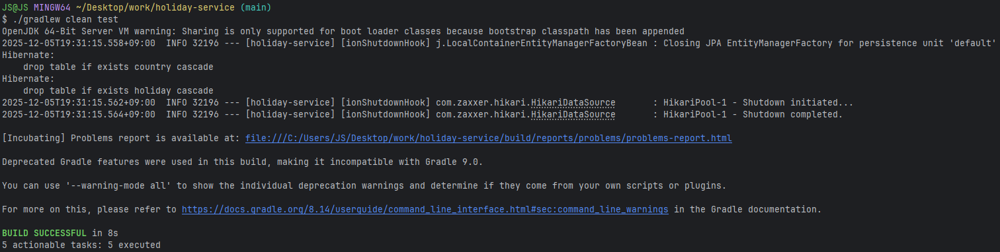

# Holiday Service

## 빌드 & 실행 방법

### 1. 빌드

```bash
./gradlew build
```

### 2. 실행

```bash
./gradlew bootRun
```

### 3. 접속 정보

- **API 서버**: http://localhost:8080
- **Swagger UI**: http://localhost:8080/swagger-ui.html
- **H2 Console**: http://localhost:8080/h2-console
    - JDBC URL: `jdbc:h2:mem:testdb`
    - Username: `sa`
    - Password: (비어있음)

### 4. 테스트

```bash
./gradlew clean test
```



---

## REST API 명세서

### 1. 데이터 초기 적재

#### `POST /api/holidays/init`

최초 실행 시 최근 5년(2021~2025)의 모든 국가 공휴일 데이터를 일괄 적재

**Request**

```http
POST /api/holidays/init
Content-Type: application/json
```

**Response**

```json
{
  "status": "SUCCESS",
  "message": "데이터 적재 완료",
  "data": {
    "totalCountries": 119,
    "totalYears": 5,
    "totalRecords": 8340,
    "processedAt": "2025-01-15T11:30:00"
  }
}
```

**Status Code**

- `200 OK`: 성공
- `500 Internal Server Error`: 외부 API 호출 실패

---

### 2. 공휴일 검색

#### `GET /api/holidays`

연도별, 국가별 필터 기반 공휴일 조회

**Request**

```http
GET /api/holidays?year=2025&countryCode=KR&dateFrom=2025-01-01&dateTo=2025-12-31&page=0&size=20&sort=asc
```

**Query Parameters**

| Parameter   | Type    | Required | Description                | Example    |
|-------------|---------|----------|----------------------------|------------|
| year        | Integer | No       | 조회 연도                      | 2025       |
| countryCode | String  | No       | 국가 코드 (ISO 3166-1 alpha-2) | KR, US     |
| dateFrom    | String  | No       | 시작 날짜 (yyyy-MM-dd)         | 2025-01-01 |
| dateTo      | String  | No       | 종료 날짜 (yyyy-MM-dd)         | 2025-12-31 |
| page        | Integer | No       | 페이지 번호 (0부터 시작, 기본값: 0)    | 0          |
| size        | Integer | No       | 페이지 크기 (기본값: 20, 최대: 100)  | 20         |
| sort        | String  | No       | 정렬 기준 (기본값: asc)           | asc / desc |

**Response (페이징)**

```json
{
  "content": [
    {
      "date": "2025-01-01",
      "localName": "새해",
      "name": "New Year's Day",
      "countryCode": "KR",
      "fixed": false,
      "global": true,
      "counties": null,
      "types": [
        "Public"
      ]
    },
    {
      "date": "2025-01-28",
      "localName": "설날",
      "name": "Lunar New Year",
      "countryCode": "KR",
      "fixed": false,
      "global": true,
      "counties": null,
      "types": [
        "Public"
      ]
    }
  ],
  "pageable": {
    "pageNumber": 0,
    "pageSize": 2,
    "sort": {
      "empty": false,
      "sorted": true,
      "unsorted": false
    },
    "offset": 0,
    "paged": true,
    "unpaged": false
  },
  "last": false,
  "totalPages": 8,
  "totalElements": 15,
  "first": true,
  "size": 2,
  "number": 0,
  "sort": {
    "empty": false,
    "sorted": true,
    "unsorted": false
  },
  "numberOfElements": 2,
  "empty": false
}
```

**Status Code**

- `200 OK`: 성공
- `400 Bad Request`: 잘못된 파라미터

---

### 3. 데이터 재동기화

#### `POST /api/holidays/refresh`

특정 연도와 국가의 공휴일 데이터를 외부 API에서 다시 가져와 업데이트 (Upsert)

**Request**

```http
POST /api/holidays/refresh
Content-Type: application/json

{
  "year": 2025,
  "countryCode": "KR"
}
```

**Request Body**

| Field       | Type    | Required | Description | Example |
|-------------|---------|----------|-------------|---------|
| year        | Integer | Yes      | 재동기화할 연도    | 2025    |
| countryCode | String  | Yes      | 재동기화할 국가 코드 | KR      |

**Response**

```json
{
  "status": "SUCCESS",
  "message": "재동기화 완료",
  "data": {
    "year": 2025,
    "countryCode": "KR",
    "updatedRecords": 15,
    "insertedRecords": 0,
    "processedAt": "2025-01-15T11:30:00"
  }
}
```

**Status Code**

- `200 OK`: 성공
- `400 Bad Request`: 필수 파라미터 누락
- `404 Not Found`: 유효하지 않은 국가 코드
- `500 Internal Server Error`: 외부 API 호출 실패

---

### 4. 데이터 삭제

#### `DELETE /api/holidays`

특정 연도와 국가의 모든 공휴일 데이터 삭제

**Request**

```http
DELETE /api/holidays?year=2025&countryCode=KR
```

**Query Parameters**

| Parameter   | Type    | Required | Description | Example |
|-------------|---------|----------|-------------|---------|
| year        | Integer | Yes      | 삭제할 연도      | 2025    |
| countryCode | String  | Yes      | 삭제할 국가 코드   | KR      |

**Response**

```json
{
  "status": "SUCCESS",
  "message": "삭제 완료",
  "data": {
    "year": 2025,
    "countryCode": "KR",
    "deletedRecords": 15,
    "processedAt": "2025-01-15T11:30:00"
  }
}
```

**Status Code**

- `200 OK`: 성공
- `400 Bad Request`: 필수 파라미터 누락
- `404 Not Found`: 삭제할 데이터가 없음

---

### 공통 에러 응답

```json
{
  "status": "ERROR",
  "message": "에러 메시지",
  "error": "error",
  "timestamp": "2025-01-15T11:45:00"
}
```

## 기술 스택

- **Java**: 21
- **Spring Boot**: 3.4.0
- **Spring Data JPA**
-
    - **Spring Scheduling**: 공휴일 데이터 자동 동기화
- **H2 Database**
- **Lombok**
- **SpringDoc OpenAPI 3**: API 문서 자동화 (Swagger UI)
- **Gradle**: 빌드 도구